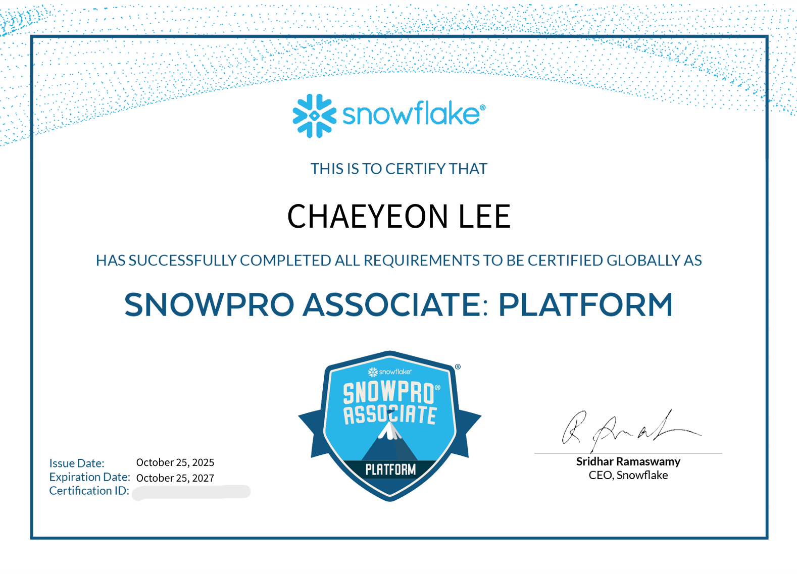

# ❄️ Snowflake Ascent 핸즈온랩 정리

이 리포지토리는 **2025년 7월 22일**에 진행된 **Snowflake Ascent: Platform Education**에서 제공된 노트북과 자료를 담고 있습니다.

> **행사:** Ascent: Snowflake Platform Training - APAC - Korea   
> **일자:** 2025년 7월 22일  
> **시간:** 13:00 – 17:30 KST  
> **언어:** 한국어  
> **지역:** APAC – 대한민국

---

## SnowPro Associate: Platform Certification 취득 완료 (2025.10.26)

---

## 📚 실습 개요

| 노트북 | 설명 |
|--------|------|
| `OB_LAB_1_INTERACTING_WITH_SNOWFLAKE.ipynb` | Snowflake UI와 콘솔을 통한 기본 상호작용 실습 |
| `OB_LAB_2_IDENTITY_AND_ACCESS.ipynb` | 사용자 및 역할 관리, 보안 설정과 권한 구성 실습 |
| `OB_LAB_3_DATABASE_OBJECT_HIERARCHY.ipynb` | 데이터베이스, 스키마, 테이블 등 오브젝트 계층 구조 이해 |
| `OB_LAB_4_TABLES_DATATYPES_LOADING_DATA.ipynb` | 테이블 생성, 데이터 타입, 데이터 로드 방법 실습 |
| `OB_LAB_5_WAREHOUSES_AND_CONTEXT.ipynb` | 웨어하우스 개념과 세션 컨텍스트 설정 학습 |
| `OB_LAB_6_LOAD_WIZARD_MARKETPLACE.ipynb` | Load Wizard 사용 및 Marketplace를 통한 데이터 탐색 실습 |
| `OB_LAB_7_CHECK_YOUR_CODE.ipynb` | 코드 확인을 통한 실습 이해도 점검 |
| `OB_LAB_8_STAGES_AND_SEMI_STRUCTURED_DATA.ipynb` | Stage를 통한 파일 적재 및 JSON과 같은 반정형 데이터 처리 |
| `OB_LAB_9_UNSTRUCTURED_DATA_CORTEX_LLM_FUNCTIONS.ipynb` | 비정형 데이터 분석 및 Cortex LLM을 활용한 텍스트 분류 |

---

## 💡 주요 학습 주제

- Snowflake 아키텍처 구성: 스토리지 / 컴퓨트 / 클라우드 서비스 계층
- 데이터 적재 흐름 이해 및 실습
  - STAGE 객체 생성
  - FILE FORMAT 설정
  - COPY INTO 명령어로 병렬 로딩 수행
- VARIANT 타입을 활용한 JSON 데이터 처리
- Snowflake 노트북 환경에서 직접 SQL 및 Python 코드 실행
- Snowpark를 활용한 데이터프레임 연산 및 처리 흐름 이해
- Cortex 기능으로 텍스트 분류 등 LLM 기반 AI 활용 실습

---

## 🧑‍💻 필요 조건

- Snowflake 체험 계정 (행사 중 제공됨)
- 웹 브라우저
- (선택 사항) Git 및 Jupyter 로컬 실행 환경

---

## 📎 참고 자료

- [Snowflake 공식 문서](https://docs.snowflake.com/)
- [Snowflake Cortex](https://www.snowflake.com/en/product/cortex/)
- [Snowpark 개요](https://docs.snowflake.com/en/developer-guide/snowpark/intro)

---

### ⚠️ 주의사항: 셀 실행 결과 미표시

이 노트북은 **스노우플레이크 UI에서 실행 후 저장된 파일**로,  
GitHub에서 **셀 실행 결과(Output)** 는 표시되지 않습니다.  
실행 결과를 보려면 로컬 또는 Colab에서 전체 셀을 실행한 후 확인해야합니다.

